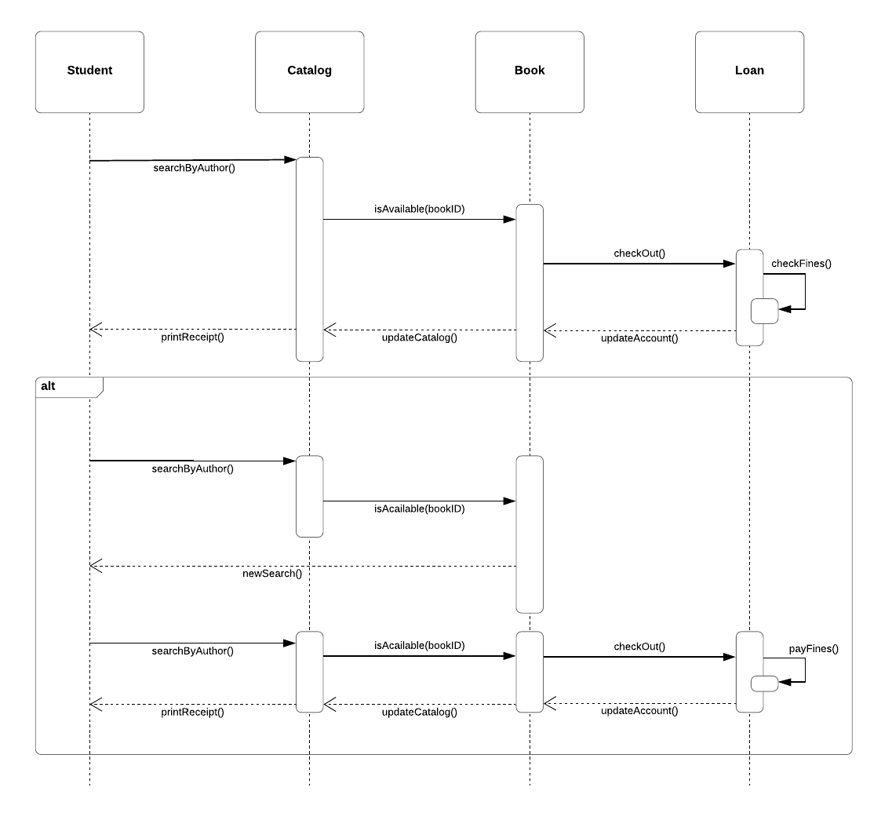
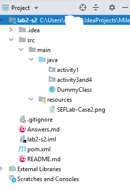

# Software Engineering Fundamentals - Lab #2: UML Diagrams & Design


This assessment is part of the _individual assessments_ of the course. 

<br/>

## Introduction

This assessment evaluates the following CLOs:

- CLO 1: Explain and apply the main aspects of software engineering.
- CLO 3: apply the process of analysis and design using the object-oriented approach
- CLO 5: communicate effectively with others, especially regarding the progress of the system development and the content of the design by means of reports and presentations.

The following topics are assessed:

- OO Structural Design
- OO Behavioural Design
- Design Principles


<br/>

## Setting Up

Once you accept the assignment, your own private repository will be created. You must clone it to your computer. Then, work there, and once you are finish, open a git command window, and perform the following:

```
git add -A
git commit -m "Solving assessment"
git push origin master
```


<br/><br/>

## Case: LoyaltyProgram
You are given the following Sequence Diagram:


 
 
 
**Activity 1**
 
Implement the classes following the sequence diagram. Put the classes in `src/main/java/activity1`. Delete the `DummyFile_Ignore`. Methods should be empty or return a dummy value (empty String `""`, or `1`, or `0.0`, depending on its return value).
<br/>


**Activity 2**

Answer the following questions by writing them the `Answers.md` file. Follow the template presented there.

1. What errors can you see in this diagram? Make a list and explain why they are an error. Explain how you will solve them. DO NOT MODIFY THE ORIGINAL SEQUENCE DIAGRAM.

2. Following the diagram, a `Book` can only be `available` or taken. A new requirement wants to add an `onHold` state to the book. Will it affect this diagram and code? Why, why not? 

3. Fix all the errors of the sequence diagram (point 1), and implement the code (point 2). The new classes should go on `src/main/java/activity2`. Delete the `DummyFile_Ignore`.


<br/>

**Activity 3**
_Problem:_ Create a class diagram from this sequence diagram (FOR THE ONE YOU FIXED IN ACTIVITY 2, POINT 3). It must match the code that you implemented before and the sequence diagram (FROM POINT 3).

4. Explain and justify ALL the assumptions that you made when creating the class diagram.

5. Select at least two of those assumptions, and explain alternative solutions. Also explain why you didn't use the alternative.


<br/><br/>

### Final Folder Structure

You project should look something as the following. _Remember to delete the DummyFiles!!_

Both IntelliJIdea or Eclipse are suitable to complete this project. There is no restriction in which IDE you can use.




<br/><br/>
## Rubric

Please visit the Canvas shell to see the rubric.
